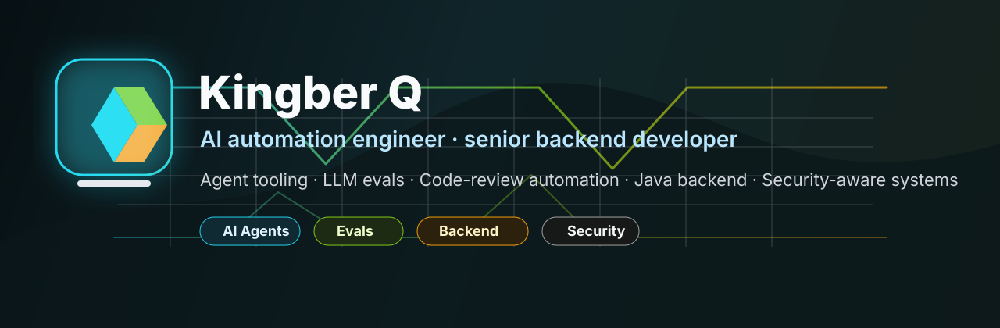

# Kingber Q

AI automation engineer and senior backend developer building agent tooling,
LLM evaluation systems, code-review automation, and security-aware backend
infrastructure.

Most of my production Java work is proprietary company code, so this profile does
not expose those repositories. Public projects here are sanitized side projects
and engineering tools that show how I approach automation, infrastructure,
cryptography-adjacent systems, and reliability work.

## What I Work On

- AI automation: agent tool routing, LLM workflow integration, prompt/version
  control, eval harnesses, code review automation, and internal assistants.
- Java backend systems: Spring Boot, microservices, data pipelines, distributed
  jobs, performance tuning, reliability, and production debugging.
- Security-aware tooling: read-only blockchain analytics, token/liquidity risk
  checks, private-key-safe automation, and operational guardrails.
- Systems automation: Rust/Python services, GPU/CUDA experiments, monitoring,
  background workers, and deployment scripts.

## Stack

Java, Spring Boot, PostgreSQL, Redis, Kafka, Docker, Linux, Rust, Python,
TypeScript, Node.js, Solidity, EVM tooling, OpenAI/Claude APIs, CI/CD, observability.

## Public Code Note

My public GitHub is intentionally not a mirror of my commercial Java work. When
evaluating me for Java/backend roles, treat this profile as evidence of breadth,
automation ability, and engineering taste rather than a full archive of company
code.

I can discuss proprietary Java experience at the architecture and implementation
level without sharing private source code.

## Public Repositories To Start With

- [ai-code-review-sentinel](https://github.com/kingberQ/ai-code-review-sentinel)
  - AI-first code review guardrail with deterministic risk scanning and optional
  OpenAI-compatible review.
- [llm-eval-harness](https://github.com/kingberQ/llm-eval-harness)
  - dependency-free Python harness for prompt, output, and safety regression
  tests.
- [ai-agent-tool-router](https://github.com/kingberQ/ai-agent-tool-router)
  - safe agent tool router with allowlists, argument validation, dry-run mode,
  and audit logs.
- [java-ai-backend-playbook](https://github.com/kingberQ/java-ai-backend-playbook)
  - non-confidential Java backend, AI integration, and remote delivery notes.
- [readonly-token-risk-detector](https://github.com/kingberQ/readonly-token-risk-detector)
  - read-only Ethereum liquidity and exit-path risk detector. No private keys,
  no approvals, no transactions.

## Work Style

Based in China, UTC+8. Strong fit for async remote work, focused implementation
sprints, backend rescue work, AI integration projects, and long-running technical
maintenance contracts.
